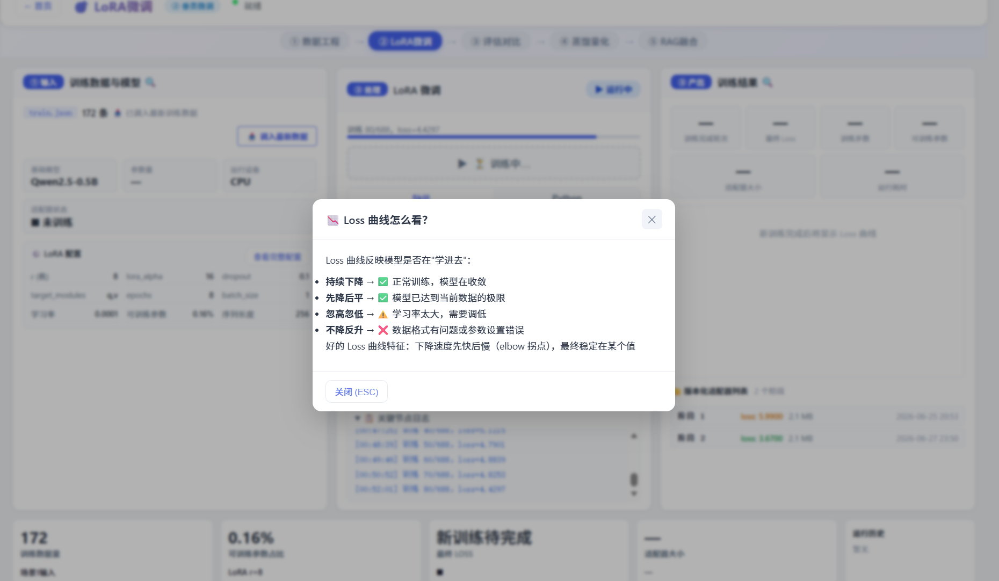
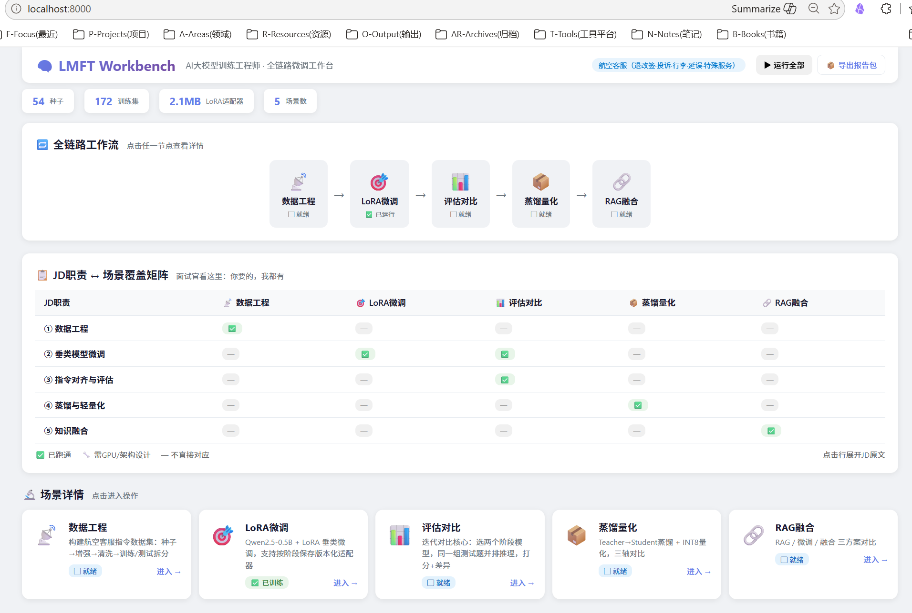
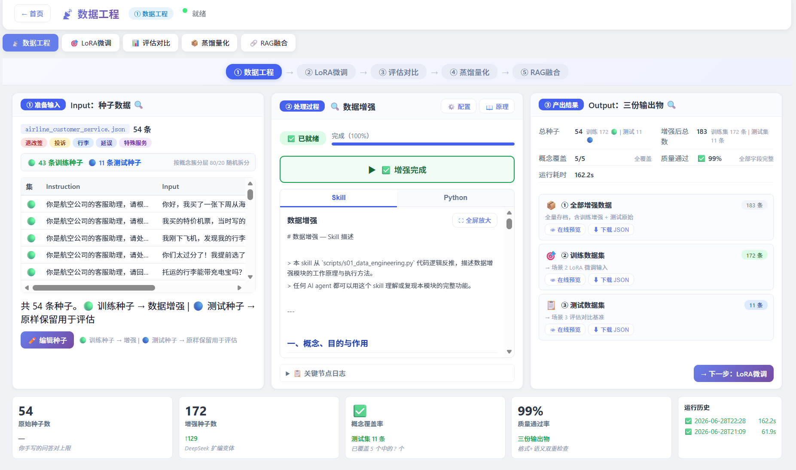
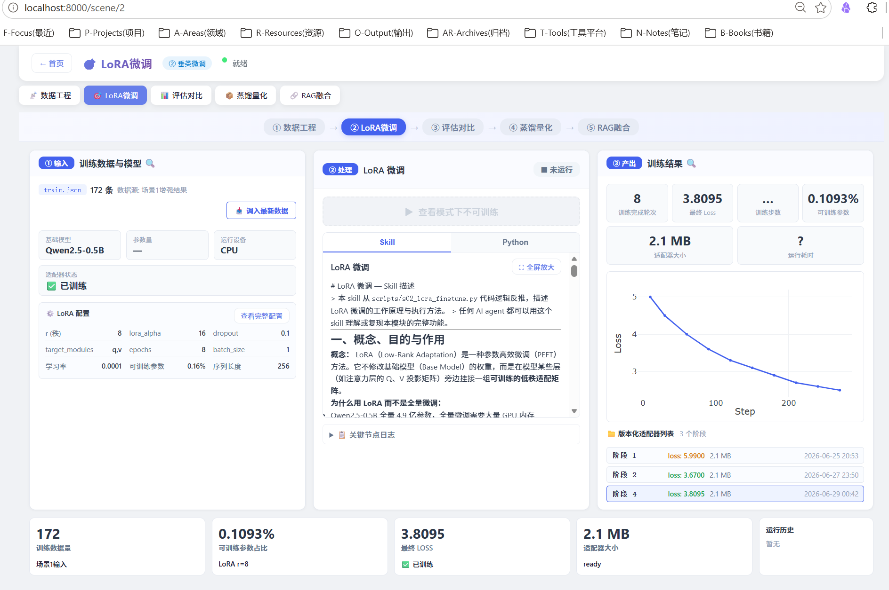
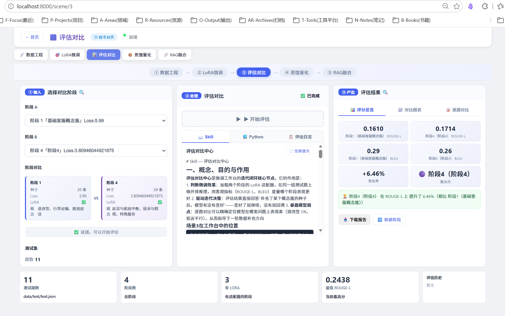
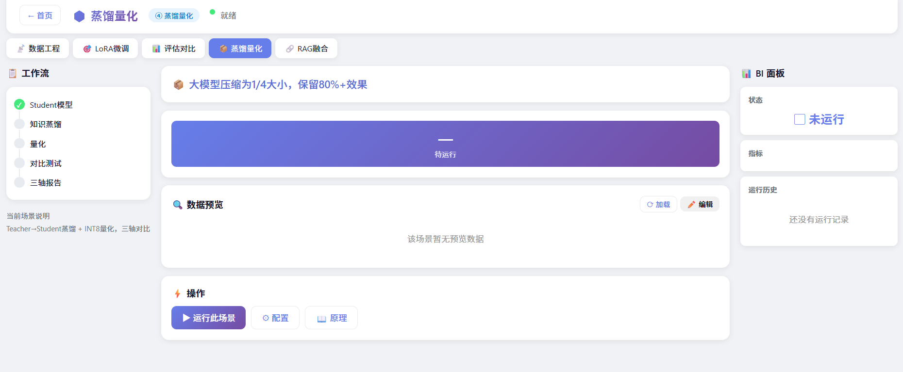
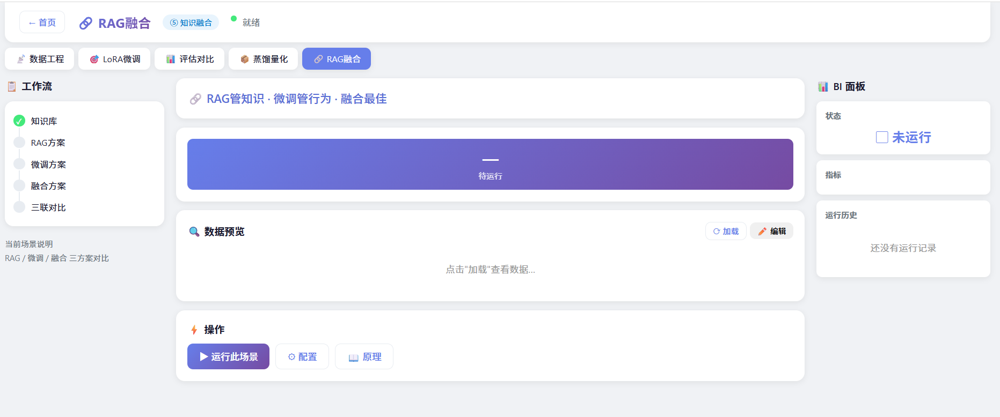

# LMFT Workbench — AI大模型训练工程师 全链路微调工作台

> 作者：刘林阳 | 15+年企业级软件研发+AI工程落地经验
> 项目状态：v1.6.2 | 核心链路验收通过（场景1→2→3→4→5）

---

## 一、一句话说清楚它是什么

**LMFT Workbench 是一个"看得见、能点开、能迭代"的 AI 全链路微调工程平台。**

它把大模型微调的完整流程——从种子设计、数据增强、LoRA 训练、对比评估、蒸馏量化到 RAG 融合——做成了一个**可交互的三栏可视化工作台**。打开浏览器就能操作，不需要写一行代码。

可以帮助**内部转岗工程师**快速理解掌握该领域的概念、知识、工作流程、实操技巧，可真实运行。



---

## 二、五大场景全景

整个系统覆盖 AI 大模型微调全链路的 **5 个核心场景**，每个场景都是一个完整的 IPO（Input-Process-Output）模块化设计：



### 📡 场景1：数据工程（✅ 已完成）

> 构建航空客服指令数据集的全流程：种子设计 → 增强 → 清洗 → 训练/测试拆分

| IPO | 内容 |
|-----|------|
| **I（输入）** | 种子问答对（目前50条，覆盖退改签/投诉/行李/延误/特殊服务 5大主题） |
| **P（处理）** | DeepSeek API 逐条变体生成 + 规则兜底增强 |
| **O（输出）** | 增强后训练集 + 测试集 + 统计数据报告 |

- 50 条种子 → 172 条训练数据 + 11 条测试数据
- 在线预览 & 下载 JSON



### 🎯 场景2：LoRA 微调（✅ 已完成）

> 基于 Qwen2.5 的 LoRA/QLoRA 高效微调，按阶段保存版本化适配器

| IPO | 内容 |
|-----|------|
| **I（输入）** | 训练数据 + LoRA 配置参数（r/alpha/dropout/epochs/lr…） |
| **P（处理）** | CPU 全流程训练，异步轮询进度，20+分钟长任务不阻塞 |
| **O（输出）** | 版本化适配器 + Loss 曲线 + 训练报告 |

- **双模式设计**：查看历史阶段（面板联动切换）vs 调入最新数据开启新训练
- **阶段版本快照**：每次训练的种子、数据、适配器、Loss 曲线全部存档
- 已验证：172 条数据 × 8 epoch ≈ 40 分钟训练，Loss 从 5.99 降至 3.81



### 📊 场景3：评估对比（✅ 已完成）

> 迭代闭环的核心——两个阶段在同一组测试题上并排推理、打分、差异分析

| IPO | 内容 |
|-----|------|
| **I（输入）** | 选定阶段 A（基线）和阶段 B（新版） |
| **P（处理）** | 两阶段模型分别推理测试题 → ROUGE-L/BLEU 评分 → 逐题对比 |
| **O（输出）** | 评分看板 + 对比图表 + 逐题对比 + 完整下载报告 |

- 异步后台评估（10~20分钟），前端实时轮询进度
- 4 张评分卡 + 3 张 Plotly 图表 + 逐题展开对比
- 支持快速迭代判断："这次微调有效果吗？" → 量化结论



### 📦 场景4：蒸馏量化（🔄 迭代升级中）

> Teacher → Student 知识蒸馏 + INT8 量化，满足私有化部署需求

| IPO | 内容 |
|-----|------|
| **I（输入）** | 已微调的 Teacher 模型 + Student 模型选择 |
| **P（处理）** | 知识蒸馏 + INT8 量化 + 三轴对比（精度/速度/体积） |
| **O（输出）** | 蒸馏量化报告 + 三轴对比图 + 量化后模型 |

> *IPO 交互模块已设计就绪，正在迭代升级中。*



### 🔗 场景5：RAG 融合（🔄 迭代升级中）

> 纯微调 vs 纯 RAG vs 微调+RAG 融合——三方案对比，验证工业级正确路线

| IPO       | 内容                      |
| --------- | ----------------------- |
| **I（输入）** | 知识库（业务文档 + 工作手册）+ 微调适配器 |
| **P（处理）** | 三种方案并行推理 + 效果评分对比       |
| **O（输出）** | 三联对比报告 + 方案推荐 + 溯源码     |

> *IPO 交互模块已设计就绪，正在迭代升级中。*



---

## 三、核心能力展示

### 🔥 能力 1：全链路工程落地

不是单个 Notebook，不是拼凑的教程代码。5 个场景覆盖了从"原始种子"到"可评估的微调模型"的全链路，每个场景都是一个独立可运行的 IPO 模块。数据流可以在场景之间完整串联：场景1产出 → 场景2训练 → 场景3评估。

### 🔥 能力 2：迭代思维与工程规范

系统内置了一套完整的**阶段版本快照**体系：

```
versions/
  stage_1/   — 基础客服概念簇（20种子，Loss=5.99）
  stage_2/   — 种子优化+参数调优（20种子，Loss=3.67）
  stage_3/   — [跳过]
  stage_4/   — 50种子扩增（54种子，Loss=3.81）
```

每一个阶段都是一次完整的快照——用了哪份种子、Train/Test 数据是什么、Loss 曲线、LoRA 权重、训练超参数——全部存档。选中任意阶段，面板联动展示该阶段的完整状态。这是可以"迭代一百次"的生产环境。

配套工程规范包括：Git 双 remote 版本管理、编码/弹窗/布局规约、Multi-Agent 协作工程规范。项目本身就是这套规范的第一验证案例。

### 🔥 能力 3：技术深度——微调 vs RAG 的路线判断

全链路跑通后，项目产出了一个硬核认知——这不是理论推演，是经过三轮实际训练验证的：

| 结论 | 证据 |
|------|------|
| **纯微调不能单独用于知识密集型问答** | Qwen2.5-0.5B × 172 条训练数据，ROUGE-L 最高仅 0.17，BLEU 最高 0.37，超出训练分布后必然胡言乱语 |
| **微调的正确定位是"风格对齐"** | 调整语气、回复格式、思考方式，不是注入专业知识 |
| **知识注入靠 RAG** | 检索引擎从完整知识库（工作手册/政策文档/FAQ）中拉相关片段，LLM 做阅读理解——工业级可靠的架构 |

能说出"这个方案行不通、为什么行不通、正确的路应该怎么走"——这是 20 年工程经验沉淀出来的判断力。

### 🔥 能力 4：技术栈宽度

| 领域 | 技术选型 | 深度 |
|------|---------|------|
| 基础模型 | Qwen2.5-0.5B（可升 1.5B/7B） | 从头调通全链路 |
| 微调方案 | LoRA (r=8, α=16, q_proj+v_proj) | 参数调优、版本化管理 |
| 数据工程 | 种子增强 + DeepSeek API 生成 + 多倍扩增 | 50 种子 → 172 条训练 |
| 评估体系 | ROUGE-L + BLEU + 逐题对比 + 人工质检 | 3 层检验 |
| 混合架构 | 微调+知识库+RAG | 深度认知独立判断 |
| 后端 | FastAPI + TaskManager 异步 | 模块化重构 |
| 前端 | Jinja2 + Plotly + IPO 三栏布局 | 可交互可迭代 |
| 工程 | Git 双 remote + 版本化 + Skill/规约体系 | 企业级规范 |
| 多 Agent 协作 | OpenClaw sub-agent + CLAUDE.md + AGENTS.md | 多平台兼容 |

---

## 四、项目架构与工作流

### 整体架构（FastAPI 模块化）

```
server.py              ← 应用入口（~50行，只负责注册）
  app_config.py        ← 场景/JD/统计函数（~175行）
  routes/pages.py      ← 页面路由
  routes/scenes.py     ← 全部场景 API（~542行）
  services/task_manager.py  ← 异步任务管理（~100行）
```

### 交互体验

每个场景采用 IPO 三栏布局（Input → Process → Output）：
- **Input（输入区）**：调参数、选数据、设配置
- **Process（处理区）**：实时日志、进度条、Loss 曲线
- **Output（输出区）**：评分卡、图表、下载报告

从数据到训练到评估，浏览器里一站式完成。

---

## 五、开放的合作方向

| 方向 | 适合场景 | 切入点 |
|------|---------|--------|
| **企业 AI 能力搭建** | 企业内部搭建微调 + RAG 知识库 | 全链路搭建能力 + 工程规范 |
| **AI 教育/培训** | 可视化教学"微调原理" | IPO 架构天然适合教学 |
| **企业知识库+AI Agent** | 客服、文档、SOP 智能化 | 微调+RAG 的深度对比经验 |
| **一人公司/AI 产品** | 快速验证 AI 可行性 | 从数据到评估的闭环工具 |

---

## 六、定位与边界

### 这个系统是

- ✅ 一个全链路微调的**工程验证平台**
- ✅ 一个展示全链路工程能力的**技术展品**
- ✅ 一个可以引入企业数据、快速跑验证的**可行性测试床**

### 这个系统不是

- ❌ 不是一个可以直接商用的产品（缺用户系统、权限管理、前端封装）
- ❌ 不是学术论文级别的实验平台（没有穷尽超参搜索、多轮 ablation）
- ❌ 不是一个"训完就能部署上线"的完整方案（量化部署、服务化、运维是后续工作）

**坦诚是专业的底气**——知道项目在什么阶段、缺什么、下一步怎么走。

---

## 七、关于我

- **15+年企业级软件工程经验**：从 Java 代码写到产品线、写到部门经理，做过 MRO/ERP/SOP/BI 驾驶舱——知道什么叫"能上线的系统"
- **跨领域技术判断力**：MRO 时代航空维修 ERP 的系统可靠性标准，平移到了 AI 时代的评估体系设计
- **实战验证的结论**：项目的核心洞见（微调不是知识注入、RAG 才是正路）是用三轮训练、十个小时的 CPU 烤出来的
- **能说清楚"什么能做、什么不能做"**：在 AI 泡沫期，给出诚实技术判断的能力比写代码的能力更稀缺

---

## 联系

- 刘林阳
- 邮箱： liulinyang85@yeah.net
- 电话： 18976426325
- 项目代码（部分公开）：https://github.com/wind-laughing/lmft-demo
