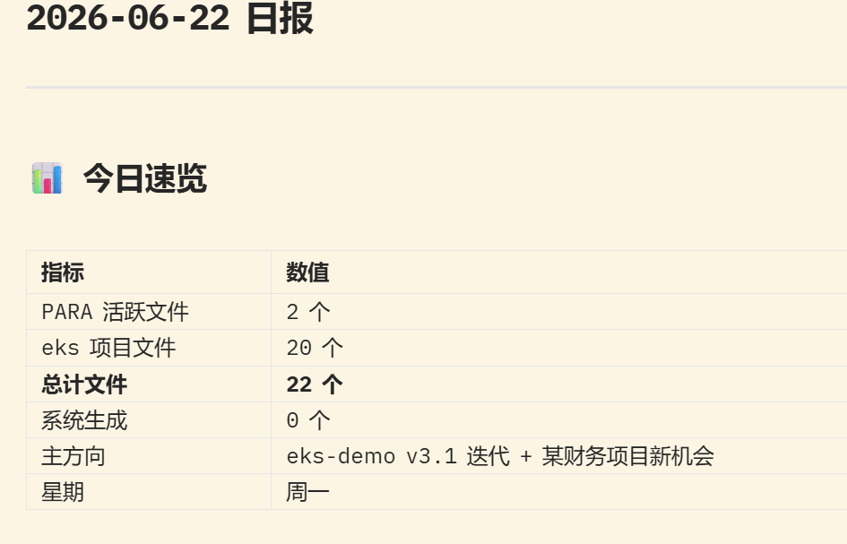
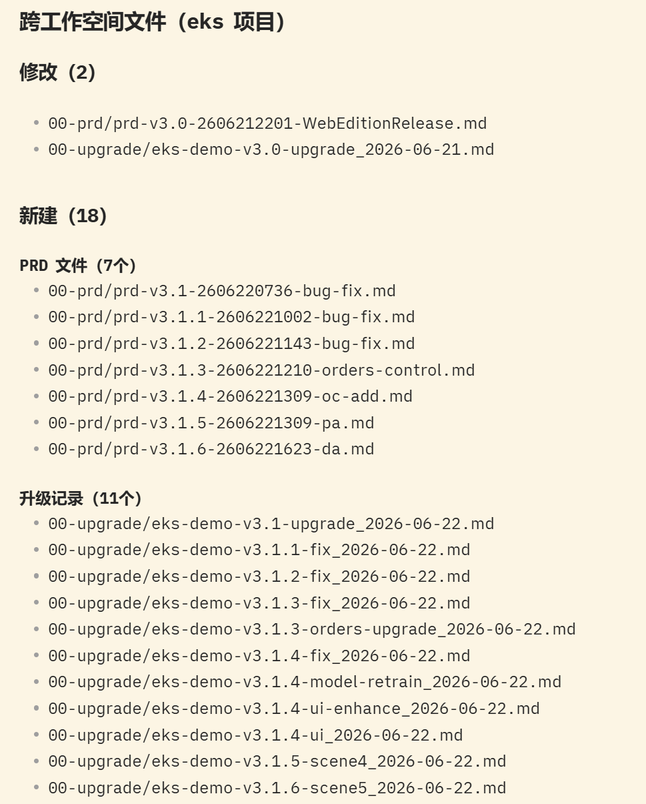
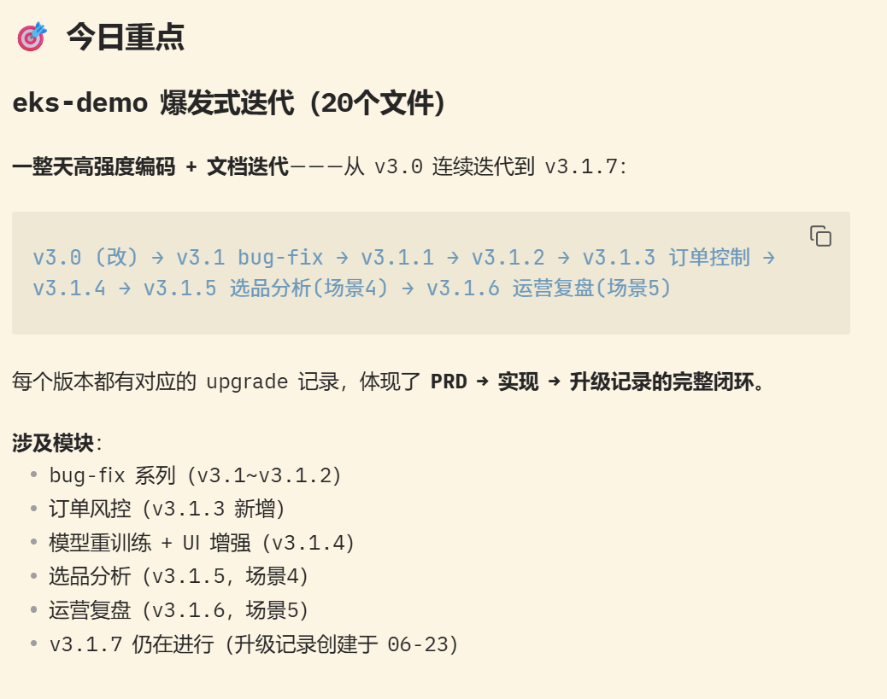
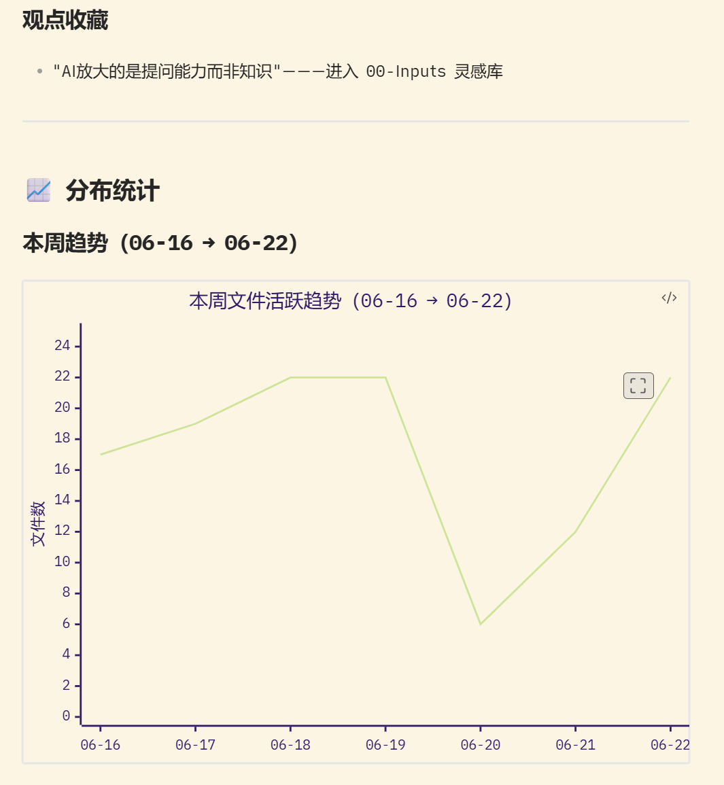
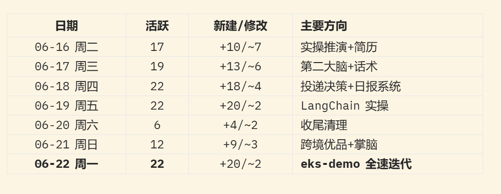
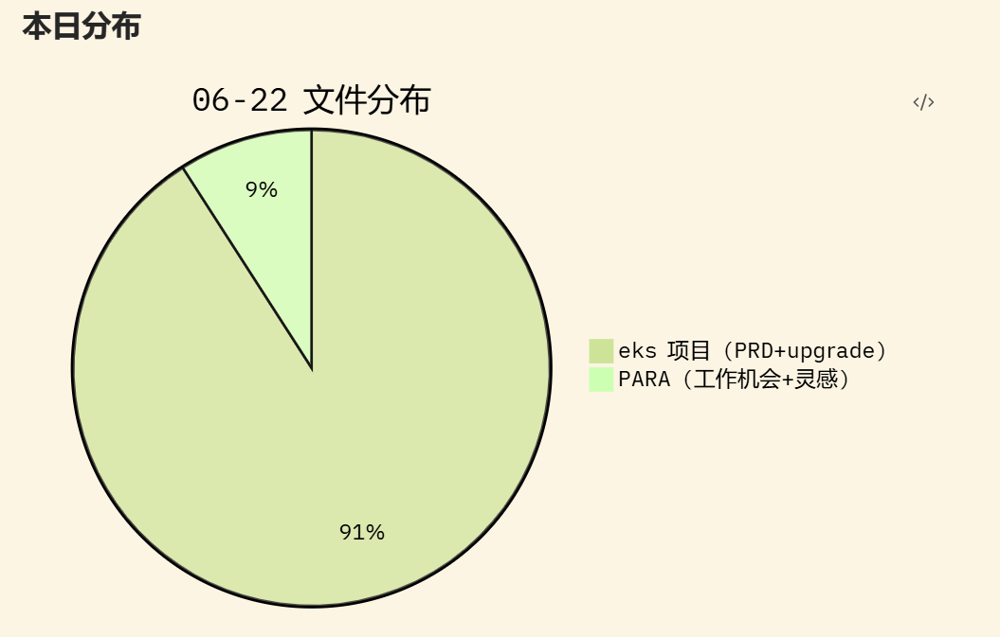
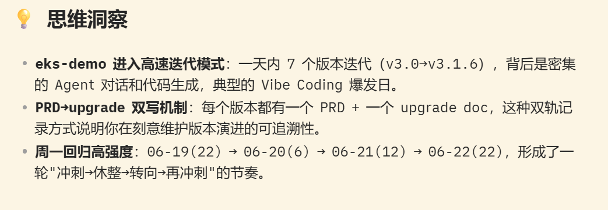
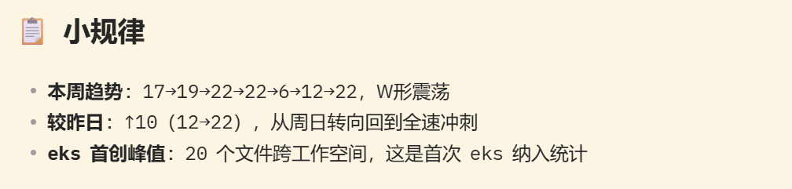
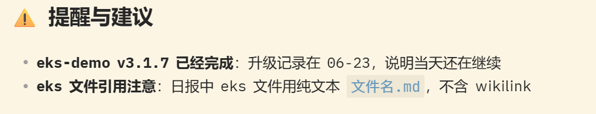

# NoteBI 日报周报自动生成系统

作者 刘林阳  📱18976426325   📧  liulinyang85@yeah.net 
## 概述

NoteBI（Note Business Intelligence）是一套基于文件系统元数据扫描的**工作行为日报/周报自动生成系统**。它不是人工写日报的工具，而是**自动感知工作空间的文件变更，从中反向识别和分析工作行为模式**。

系统运行于 OpenClaw Agent 环境，以 Skill（`daily-note-generator`）形式定义，核心能力由 PowerShell 脚本 + Mermaid 图表 + 结构化 Markdown 组成。

## 解决的问题

| 问题      | 手工方案       | NoteBI 方案              |
| ------- | ---------- | ---------------------- |
| 写日报消耗精力 | 每天回忆干了什么   | 自动扫描文件变更，被动生成          |
| 数据不可追溯  | 凭感觉写"今天很忙" | 趋势折线图 + 统计快照 → 可回溯     |
| 跨周趋势模糊  | 翻聊天记录      | JSON stat 逐日累积，支持周趋势计算 |
| 多个工作空间  | 分不清代码和文档   | 内置跨工作空间扫描（PARA + eks）  |
| 洞察靠经验   | 靠人总结规律     | 自动识别峰值日/周末行为/环比变化/热点目录 |

## 案例截图




















## 架构

```
┌──────────────┐    ┌──────────────┐    ┌──────────────┐
│  Step 1      │ →  │  Step 2/2.5  │ →  │  Step 3      │
│  确定目标日期 │    │  文件系统扫描  │    │  加载趋势数据 │
└──────────────┘    └──────────────┘    └──────┬───────┘
                                               ↓
┌──────────────┐    ┌──────────────┐    ┌──────────────┐
│  Step 6      │ ←  │  Step 5      │ ←  │  Step 4      │
│  保存统计快照 │    │  生成日报文件  │    │  模式规律识别 │
└──────────────┘    └──────────────┘    └──────────────┘
```

### 扫描层

**两个扫描路径并行执行：**

1. **PARA vault**（`D:\agent-vaults\para-vault`）
   - 知识库主空间，按 PARA 结构组织（00-Inputs / 01-Projects / 02-Areas / 03-Resources / 04-Archives / 05-Annex）
   - 排除目录：`04-Archives`, `.trash`, `.obsidian`
   - 输出：Obsidian wikilink 格式 `[[../路径/文件名]]`

2. **eks-demo 项目**（`D:\agent-projects\eks-demo`）
   - 跨工作空间项目文件
   - 子目录：`00-prd`（需求文档）、`00-upgrade`（升级记录）、`00-doc`（项目文档）
   - 输出：纯文本 `文件名.md`（不含 wikilink，因为跨工作空间）

### 分析层

- **每日统计**：新建文件数 / 修改文件数 / 目录分布 / eks 文件数
- **趋势叠加**：读取最近 7 天的 JSON 统计快照，生成趋势折线图
- **模式识别**：自动识别峰值日、周末行为、环比变化、热点目录
- **手动/系统分离**：区分 Note-BI 自生产文件 vs 真实手动工作

### 输出层

**日报结构（Markdown）：**

```
# YYYY-MM-DD 日报

## 📊 今日速览           ← 统计表格
## 📁 输出文件           ← PARA + eks 文件清单
## 🎯 今日重点           ← 主攻方向与进展分析
## 📈 分布统计           ← Mermaid 图表（折线/饼图/柱图）
## 💡 思维洞察           ← 认知变化
## 📋 小规律             ← 自动识别的模式
## ⚠️ 提醒与建议         ← 待办提醒
```

**统计快照（JSON）：**

```json
{
  "date": "2026-06-22",
  "summary": { "totalActive": 22, "new": 20, "modified": 2 },
  "eksFiles": { "total": 20, "new": 18, "modified": 2, "files": [ ... ] },
  "directoryDistribution": [ ... ],
  "newFiles": [ ... ],
  "modifiedFiles": [ ... ]
}
```

### 持久层

- **日报文件**：`D:\agent-vaults\para-vault\Note-BI\YYYY-MM-DD.md`
- **统计快照**：`D:\agent-vaults\para-vault\Note-BI\.daily-stats\YYYY-MM-DD.json`
- **趋势窗口**：7 天滚动窗口（不足时有啥算啥）

## 关键技术决策

### Mermaid 图表适配

Obsidian Kindle 主题非纯白背景，Mermaid 默认 pastel 配色太淡。最终方案：

```mermaid
%%{init: {'theme': 'forest', 'themeVariables': {'mainBkg': 'transparent', 'background': 'transparent', 'lineWidth': '3px'}}}%%
```

- 主题：`forest`（高饱和内置配色）
- 背景：透明（无白色色块干扰）
- 线宽：`3px`（加粗保证可见性）
- 不自定义色板 → 依赖内置颜色，避免 Obsidian 渲染差异

### 排除目录过滤

PowerShell 正则 `-notmatch` 在 Windows 路径下易出错（`\04-Archives\` 中的 `\0` 被解析为转义）。安全方案：

```powershell
function Get-RelTopDir($fullPath, $pvRoot) {
    $rel = $fullPath.Substring($pvRoot.Length).TrimStart('\')
    return ($rel -split '\\')[0]
}
# 然后用 -notcontains 做集合排除
```

### 中文编码

PowerShell 5.x 不支持 `??` 运算符，字符串变量 `$()` 插值在中文路径中需注意。推荐 `write` 工具直接写文件内容，不依赖管道重定向编码。

## 输出示例

### 趋势折线图

```
本周趋势（06-16 → 06-22）
┌─────────┬──────┬──────────┬─────────────────────┐
│  日期   │ 活跃 │ 新建/修改 │      主方向         │
├─────────┼──────┼──────────┼─────────────────────┤
│ 06-16 二│  17  │ +10/~7    │ 实操推演+简历       │
│ 06-17 三│  19  │ +13/~6    │ 第二大脑+话术       │
│ 06-18 四│  22  │ +18/~4    │ 投递决策+日报系统   │
│ 06-19 五│  22  │ +20/~2    │ LangChain 实操      │
│ 06-20 六│   6  │  +4/~2    │ 收尾清理            │
│ 06-21 日│  12  │  +9/~3    │ 跨境优品+掌脑       │
│ 06-22 一│  22  │ +20/~2    │ eks-demo 全速迭代   │
└─────────┴──────┴──────────┴─────────────────────┘
```

### 自动模式识别

系统在生成日报时自动识别：

- 「本周最活跃: 06-15（28 文件）」—— 峰值日
- 「周末日均 6 个文件，持续产出」—— 周末行为
- 「较昨日: ↑ 10（12→22）」—— 环比变化
- 「本周核心目录: 01-Projects/02-工作机会」—— 热点目录

## 版本演进

| 版本 | 日期 | 主要变更 |
|------|------|---------|
| v1.0 | 2026-06-18 | 基础扫描 + 日报生成 + 排除目录 |
| v1.1 | 2026-06-18 | 7天趋势折线图 + 周统计表 + 自动模式识别 |
| v2.0 | 2026-06-23 | 跨工作空间扫描（eks） + 纯文件名引用 + 报告结构升级 |

### 关键设计迭代

- Mermaid 配色：自定义深色 → forest 主题无自定义（解决 Obsidian 渲染一致性）
- 趋势数据：有 ≥2 天就显示，缺失天标注 `—`，不因不完整放弃显示
- 排除过滤：`-notmatch` 正则 → `-notcontains` + 相对路径首段提取
- 文件引用：PARA 统一 wikilink → PARA wikilink + eks 纯文本名

## Skill 配置

- **Skill 名称**：`daily-note-generator`
- **Skill 路径**：`D:\agent-home\.qclaw\skills\daily-note-generator\SKILL.md`
- **触发词**：
  - `写笔记` → 生成今日日报
  - `更新昨天笔记` / `更新X月X日笔记` → 回填/补录
- **依赖**：PowerShell 5.x+、Obsidian（Mermaid 渲染）

## 红线规则

1. 只读文件元数据（LastWriteTime、CreationTime、Length），不读文件内容
2. 绝不修改或删除用户文件
3. 生成日报的内容来源仅为文件变更数据 + 会话 memory
4. 不翻用户原文内容写洞察

## 适用场景

- **个人知识工作者**：追踪项目文件变更，自动生成工作日志
- **AI 编程实践者**：eks-demo 等 AI 项目的高速迭代阶段，文件变更反映开发节奏
- **求职方向决策**：日报中的趋势图直观展示精力投入分布，辅助判断主攻方向
- **周回顾**：7 天趋势折线图 + 本周统计表 = 一键周报素材

---

_NoteBI 系统设计文档 v1.0 | 2026-06-23 | 对应 daily-note-generator skill v2.0_
